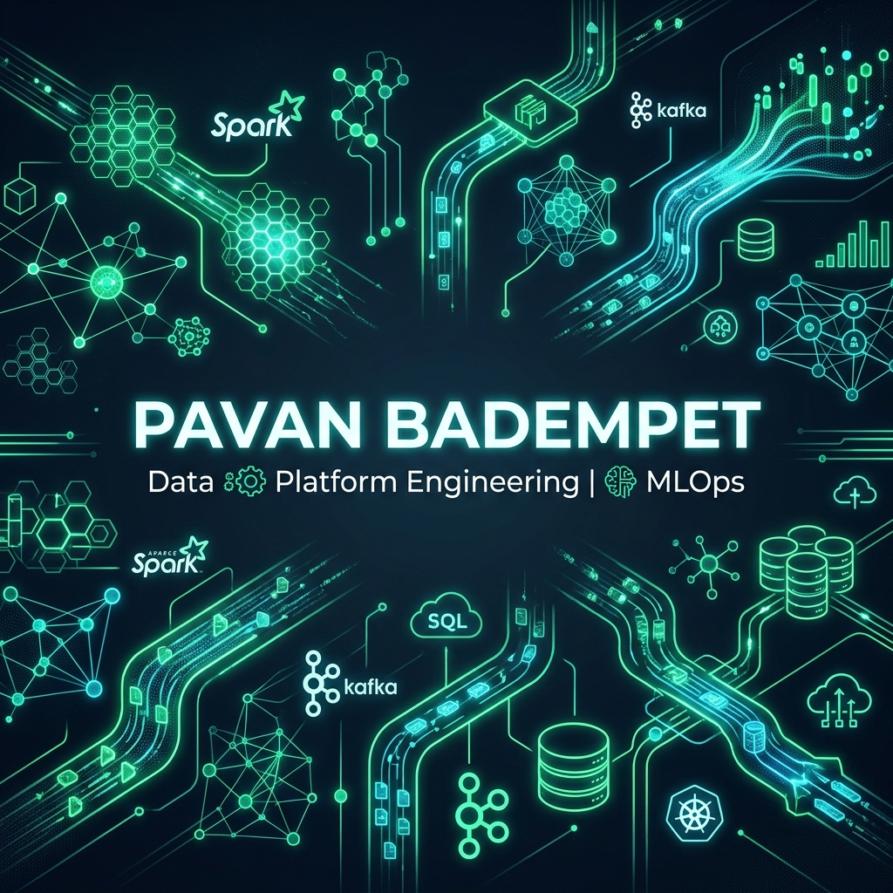

# 👋 Hi, I'm Pavan Badempet

  

## 🌌 Data & MLOps Platform Engineer | Big Data Architect

<meta itemprop="url" content="https://pavanbadempet.github.io" />
<meta itemprop="knowsAbout" content="Data Engineering, Big Data, MLOps, Apache Spark, PySpark, Delta Lake, Apache Airflow, Python, Scala, AWS, Kubernetes, PyTorch, Conformal Prediction, FT-Transformers, Lakehouse Architecture" />
<link itemprop="sameAs" href="https://www.linkedin.com/in/pavanbadempet/" />
<link itemprop="sameAs" href="https://stackoverflow.com/users/6325621/pavan-badempet" />

I am a **Data Engineer and MLOps Platform Specialist** focused on building high-throughput, distributed data platforms, scalable ETL pipelines, and machine learning infrastructure. My expertise lies in designing robust lakehouse architectures (Delta Lake, Lakefs), orchestrating complex workflows (Apache Airflow), and engineering production-grade ML pipelines.

Experienced in implementing healthcare interoperability gates (ABDM compliance), real-time vital signal streaming analytics, and deep learning clinical ensembles (FT-Transformers, Bi-LSTM temporal models) with automated cloud retraining triggers.

---

### 🚀 Technical Superpowers

<table>
  <tr>
    <td valign="top" width="50%">
      <h4><b>💻 Languages & Core</b></h4>
      <code>Python</code> • <code>Scala</code> • <code>SQL (PostgreSQL, MySQL, SQLite)</code> • <code>Java</code> • <code>TypeScript</code> • <code>Go</code> • <code>Bash</code>
        
      <h4><b>📊 Big Data & Orchestration</b></h4>
      <code>Apache Spark</code> • <code>PySpark Streaming</code> • <code>Delta Lake</code> • <code>Apache Iceberg</code> • <code>Dremio</code> • <code>Snowflake</code> • <code>Apache Airflow</code> • <code>Databricks</code> • <code>Apache Hadoop</code> • <code>Data Quality (Great Expectations)</code>
    </td>
    <td valign="top" width="50%">
      <h4><b>🤖 Machine Learning & MLOps</b></h4>
      <code>Scikit-learn</code> • <code>PyTorch</code> • <code>TensorFlow</code> • <code>TabPFN</code> • <code>Kaggle API</code> • <code>Hugging Face Hub</code> • <code>Conformal Prediction</code>
        
      <h4><b>☁️ Cloud, Databases & DevOps</b></h4>
      <code>AWS (EMR, S3, EC2, RDS, IAM)</code> • <code>Docker</code> • <code>Kubernetes</code> • <code>MinIO / HDFS</code> • <code>AutoSys</code> • <code>GitHub Actions CI/CD</code> • <code>Pinecone / SimpleVectorStore</code> • <code>Allembic / migrations</code>
    </td>
  </tr>
</table>

---

### 📂 Featured Production Projects

#### 🏥 [AI-Healthcare-System](https://github.com/pavanbadempet/AI-Healthcare-System)
*Python, PySpark Streaming, Airflow, Delta Lake, FastAPI, Docker, Kubernetes, AWS*
* Built an end-to-end data platform for **250k+ clinical records** using **Apache Airflow** and **PySpark** pipelines, staging data in partitioned **Delta Lake** tables.
* Implemented automated cloud retraining triggers via **Kaggle API** and model weight synchronization with a private **Hugging Face** dataset hub.
* Developed a **FastAPI** service with a local vector retrieval index (`turbovec` SIMD), JWT auth, and FHIR R4 clinical compliance serializers.

#### 🎬 [Movie-Recommendation-System](https://github.com/pavanbadempet/Movie-Recommendation-System)
*Python, PySpark, Airflow, Delta Lake, Redis, ONNX Runtime, FAISS, FastAPI, Docker*
* Engineered a causal movie recommendation engine using **PySpark** Medallion pipelines for ETL and feature store curation.
* Developed a real-time clickstream feedback loop using **Redis streams** to update user sequential states asynchronously (sub-10ms latency).
* Implemented an adaptive serving API with hardware-aware fallbacks (NVIDIA GPU ensembling, quantized ONNX CPU, and SIMD vector index search).

---

### 📊 GitHub Activity & Metrics

  
  

  

---

### 🌐 Connect & Collaborate

* 💼 **LinkedIn:** Connect with [Pavan Badempet on LinkedIn](https://www.linkedin.com/in/pavanbadempet/) to discuss data engineering opportunities.
* ✍️ **Blog & Portfolio:** Visit [Pavan's Data Engineering Portfolio and Blog](https://pavanbadempet.github.io) for system architecture guides and big data tutorials.
* 💬 **Stack Overflow:** View the [Pavan Badempet Stack Overflow Profile](https://stackoverflow.com/users/6325621/pavan-badempet) to see community Q&A contributions.
* 📮 **Get in Touch:** Shoot me an email or open an issue on any of my active repositories!

---

  
🔍 Career Keywords & Technical Index (SEO)

  

    This profile indexes major industry domains and systems:
    <strong>Core Specializations:</strong> Data Platform Architect, Big Data Engineer Portfolio, MLOps Pipelines, Python and Scala Developer, AWS Solutions, Lakehouse Architect.
    <strong>Distributed Platforms:</strong> Apache Spark, PySpark Streaming, Delta Lake, Apache Airflow, Databricks, Data Lakehouses, PySpark ETL.
    <strong>AI Infrastructure & Inference:</strong> FT-Transformer models, TabPFN models, PyTorch Tabular MLP ensembles, conformal prediction bounds, Hugging Face Hub, Kaggle API integration.
    <strong>Compliance & Health Informatics:</strong> Ayushman Bharat Digital Mission (ABDM) gateways, FHIR standards, vital signals streaming.
  

