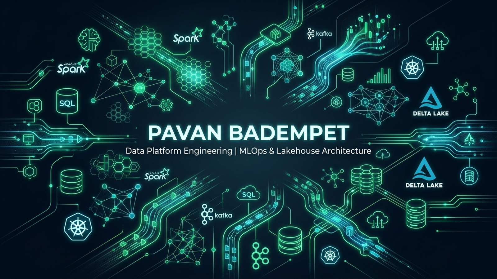

# 👋 Hi, I'm Pavan Badempet

  

  
  
  
  

## 🌌 Data & MLOps Platform Engineer | Big Data Architect

<meta itemprop="url" content="https://pavanbadempet.github.io" />
<meta itemprop="knowsAbout" content="Data Engineering, Big Data, MLOps, Apache Spark, PySpark, Delta Lake, Apache Airflow, Databricks, Python, Scala, AWS, Kubernetes, PyTorch, Conformal Prediction, Lakehouse Architecture, Recommendation Systems, Clinical Data Pipelines" />
<link itemprop="sameAs" href="https://www.linkedin.com/in/pavanbadempet/" />
<link itemprop="sameAs" href="https://stackoverflow.com/users/6325621/pavan-badempet" />

I am a **Data Platform Engineer and MLOps Architect** specializing in production-grade distributed lakehouses, high-throughput streaming pipelines, and scalable machine learning infrastructure.

* 🏗️ **Core Architectures:** Medallion Lakehouses (Delta Lake, Databricks), Real-Time Streaming (Kafka, PySpark), and Workflow Orchestration (Apache Airflow).
* 🤖 **AI & Inference:** Tabular Foundation Models, Recommendation Ensembles (SASRec, LightGCN), Vector Search (`pgvector`), and Local LLM RAG pipelines.
* 🏥 **Industry Domains:** Clinical Health Informatics (FHIR R4, OMOP CDM v5.4, ABDM compliance), Capital Markets, and Media Recommendation Platforms.

---

### 🚀 Technical Superpowers & Stack

  
  
  
  
  
  
  
  
  
  
  
  

---

### 📂 Featured Flagship Production Platforms

#### 🏥 [AI-Healthcare-System](https://github.com/pavanbadempet/AI-Healthcare-System)
*Enterprise AI Healthcare Lakehouse & Clinical Intelligence Platform*
* **Architecture:** PySpark Medallion Lakehouse, Apache Airflow pipelines, FHIR R4 / OMOP CDM v5.4 compliance, and HIPAA-ready FastAPI backend.
* **ML & RAG:** TabICLv2 Tabular Foundation Models, calibrated CatBoost/XGBoost ensembles with 95% Conformal Prediction sets, 10-year multi-organ digital twin simulator, and local Ollama LangGraph multi-agent RAG.
* **Live Links:** [🤗 Hugging Face Live Interactive Space](https://huggingface.co/spaces/pavanbadempet/aio-health-backend) &middot; [🤗 Model Hub (16 Weights)](https://huggingface.co/pavanbadempet/ai-healthcare-models) &middot; [⭐ GitHub Repository](https://github.com/pavanbadempet/AI-Healthcare-System)

#### 🎬 [AI-Recommendation-System](https://github.com/pavanbadempet/AI-Recommendation-System)
*Real-Time AI Media Recommendation Engine & Unified Data Intelligence Platform*
* **Scale:** Ingests and processes **21M+ real records** (1M+ TMDB movies and 20M+ MovieLens ratings) across a Databricks Serverless Medallion Lakehouse.
* **Deep Learning & Search:** SASRec sequential transformers, LightGCN graph embeddings, and a 10-shard Neon Serverless `pgvector` HNSW cluster (<5ms query latency).
* **Live Links:** [🌐 Live Cinema Portal Demo](https://pavanbadempet.github.io/AI-Recommendation-System/) &middot; [🤗 Hugging Face Space UI](https://huggingface.co/spaces/pavanbadempet/movie-rec-ui) &middot; [⭐ GitHub Repository](https://github.com/pavanbadempet/AI-Recommendation-System)

---

### 📊 GitHub Activity & Metrics

  
  
  

  

---

### 🌐 Connect & Professional Links

  
  
  
  
  
  

---

  
🔍 Career Keywords & Technical Index (Search Engine Optimization)

  

    <strong>Core Specializations:</strong> Lead Data Engineer, Senior Data Architect, Big Data Engineer Portfolio, MLOps Engineer, Lakehouse Architect, Python Developer, PySpark Specialist, Distributed Systems Engineer.
    <strong>Distributed Computing & Lakehouse:</strong> Apache Spark, PySpark Streaming, Delta Lake, Apache Iceberg, Apache Airflow, Databricks Medallion Lakehouse, Data Vault 2.0, SCD Type 2, Liquid Clustering, Z-Order Optimization, Great Expectations.
    <strong>Machine Learning & Search:</strong> Recommendation Engines, SASRec, LightGCN, Graph Neural Networks, PyTorch, pgvector HNSW Indexing, Vector Databases, Conformal Prediction, Hugging Face Spaces, Ollama Local Inference, LangGraph Multi-Agent RAG.
    <strong>Cloud & Infrastructure:</strong> Amazon Web Services (AWS EMR, S3, Glue, Athena, RDS, ECS), Docker Containerization, Kubernetes Orchestration, CI/CD GitHub Actions, PostgreSQL, Redis Streaming.
  

